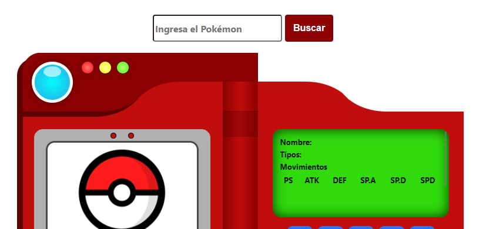

## PokéDex
 

  

  <h3 align="center">PokéDex</h3>

  

    Un pequeño sitio para consulta la PokéDex, gracias al consumo de la <a href="https://pokeapi.co/">PokeAPI</a>
     
    <a href="https://josue9405.github.io/pokedex">Abrir sitio</a>
  

## Construido con

Componentes:
* HTML
* CSS, usando de base la plantilla de <a href="https://codepen.io/Bidji/pen/MYdPwo">CodePen</a>
* JavaScript

## Responsivo

El sitio cuenta con funciones responsivas para adaptarse al disposivito desde el cual lo visualizan. Ajustando los elementos en pantalla y reordenando para que su uso en teléfonos sea posible.

    

